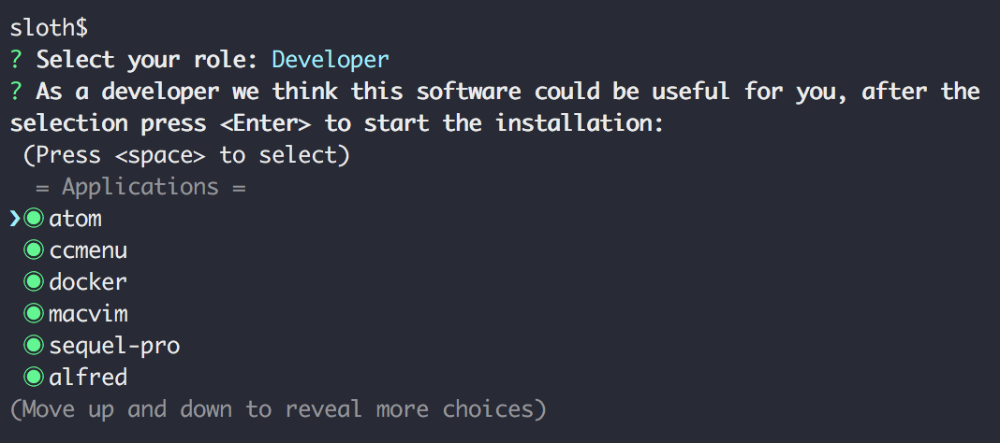

<p align="center"></p>
<h1 align="center">Sloth</h1>
<p align="center">A command line tool to automate the process of installing packages and apps on your mac.</p>
<p>&nbsp;</p>

<p align="center"></p>
<p>&nbsp;</p>

## Usage

Open **Terminal app** and just execute the following command:

```shell
git clone https://github.com/sloth-tools/sloth-cli.git && cd sloth && ./install.sh
```

After that you just need to follow the instructions:

1. You simply **choose your role** (Developer or Designer)
2. We **show you all the packages and apps** that will be installed on your laptop
3. **You can deselect** the packages or apps you don't need.

And that's it! :smile:

## How it works?

Under the hood Sloth is generating for you a configuration file with all the packages and apps to install. Then we use [Ansible Playbooks](http://docs.ansible.com/ansible/playbooks.html), [Homebrew](https://brew.sh/) and [Homebrew Cask](https://caskroom.github.io/) to automate the process of installation.

## Install more applications

1. [Download](https://github.com/sloth-tools/sloth-cli/archive/master.zip) the code to your device (or clone this repository)
2. Add more [Ansible Playbooks](http://docs.ansible.com/ansible/playbooks.html), just add them to `user` folder (you have some examples there, if you want to try remove the `*.sample` extension). You can find more applications to install [here](https://caskroom.github.io/search).
3. In the terminal, run the following command in the project's folder: 
```shell
./install.sh
```

## Adapt it to your needs

1. [Fork](https://help.github.com/articles/fork-a-repo/) this repository to your own GitHub account and then [clone](https://help.github.com/articles/cloning-a-repository/) it to your local device
2. If needed customize to your needs the following files: `roles/base.json`, `roles/developer.json` and `roles/designer.json`
3. If you want to add more [Ansible Playbooks](http://docs.ansible.com/ansible/playbooks.html), just add them to `user` folder (you have some examples there, if you want to try remove the `*.sample` extension). You can find more applications to install [here](https://caskroom.github.io/search).
4. Install the dependencies: `npm install`
5. Run the interactive command line tool: `npm start`

## Contribute

1. [Fork](https://help.github.com/articles/fork-a-repo/) this repository to your own GitHub account and then [clone](https://help.github.com/articles/cloning-a-repository/) it to your local device
2. Install the dependencies: `npm install`
3. Run the interactive command line tool: `npm start`

## Thanks!

- [XING](https://www.youtube.com/watch?v=TReXjRSlevg), because this tool was built in a [hack week](https://twitter.com/hashtag/hackweekxing) project
- The sloth icon used as a logo was created by [Richard Nixon](https://thenounproject.com/nixonrichard) and provided via [The Noun Project](https://thenounproject.com/). It is licensed under a [Creative Commons license](https://creativecommons.org/licenses/by/3.0/us/).